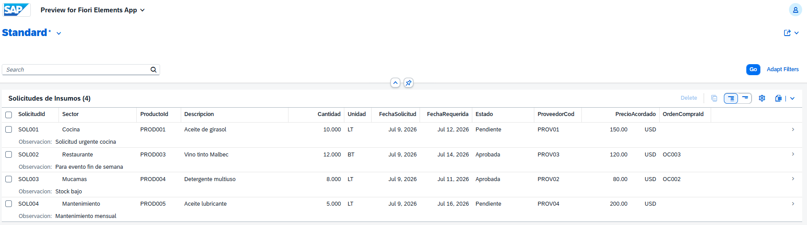

---

## Project 4 – Touchless Procurement – Supply Request App (MM / RAP)

### Business Context
Each hotel sector (Kitchen, Restaurant, Housekeeping, Maintenance) submits supply requests directly through a Fiori app using pre-negotiated supplier pricing. The system tracks each request, links it to the corresponding purchase order, and monitors approval status — eliminating manual coordination between sectors and the purchasing team.

### Technical Stack
- SAP RAP (Restful ABAP Programming Model)
- Core Data Services (CDS) – Interface View + Projection View
- Fiori Elements (List Report)
- OData V4
- SAP BTP ABAP Environment
- SAP S/4HANA Cloud (compatible development stack)

### Artifacts Created
| Artifact | Name | Description |
|---|---|---|
| Database Table | `ZSOLICITU_INSUMO` | Supply requests by sector |
| CDS Interface View | `ZI_SolicitudInsumo` | Root view entity |
| CDS Projection View | `ZC_SolicitudInsumo` | Fiori UI annotations |
| Behavior Definition | `ZI_SOLICITUDINSUMO` | Managed behavior |
| Behavior Definition | `ZC_SOLICITUDINSUMO` | Projection with create/update/delete |
| Behavior Implementation | `ZBP_I_SOLICITUDINSUMO` | Business logic handler |
| Service Definition | `ZUI_SOLICITUDINSUMO` | Exposes entity |
| Service Binding | `ZUI_SOLICITUDINSUMO_O4` | OData V4, published |

### Business Logic Implemented
- Supply requests submitted per sector with pre-negotiated supplier and price
- Request status tracked (Pending / Approved)
- Approved requests automatically linked to purchase orders via `OrdenCompraId`
- Covers all hotel sectors: Kitchen, Restaurant, Housekeeping, Maintenance

### App Screenshot
# sap-project4-touchless
